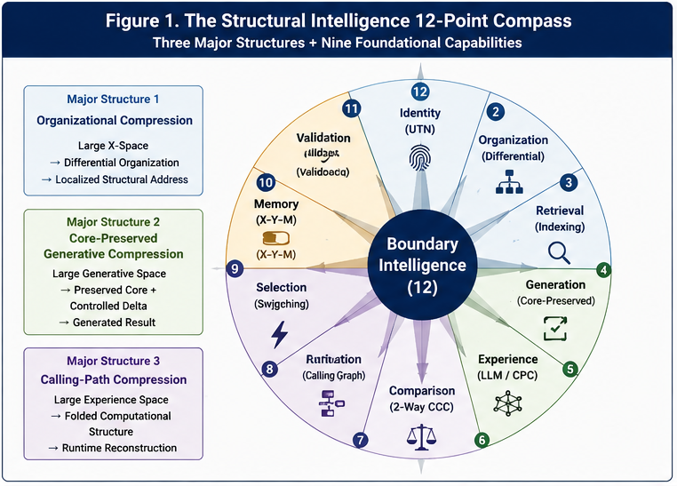
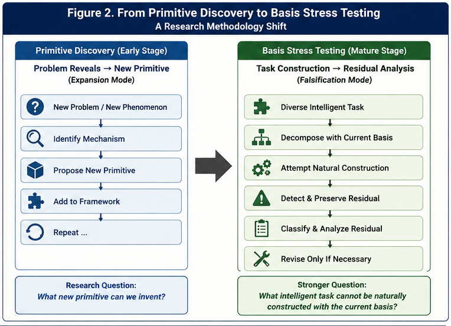

# Structural Intelligence Compass

## A 12-Point Research Compass for Structural Intelligence

> **This repository offers a compass, not a closed map.**

The **Structural Intelligence Compass** is a compact research framework for examining intelligence, computation, reasoning, organization, and their open boundaries from a structural perspective.

It does not claim to provide a complete theory of intelligence.

It does not claim that twelve points exhaust the research space.

It does not claim that any current AI system, including future hybrid or general-purpose systems, can own or terminate truth.

Instead, this repository presents a small set of questions, structural observations, engineering directions, and research frontiers that appear useful for navigating a rapidly expanding field.

The purpose is simple:

> **State what we currently see clearly enough that others can examine it, challenge it, use it, and extend it.**

---

# 1. Why a Compass?

Research in AI increasingly spans large language models, world models, agents, causal reasoning, software generation, runtime systems, knowledge organization, decision systems, and hybrid architectures.

Each direction can become deep enough to appear self-contained.

But intelligence is unlikely to be understood from only one computational perspective.

A powerful model may still expose only one family of projections.

A successful reasoning method may operate only within a particular validity boundary.

A new computational technology may bypass one form of difficulty without eliminating computational difficulty itself.

A hybrid architecture may greatly increase coverage without becoming an owner of absolute truth.

The **Structural Intelligence Compass** therefore asks a different question:

> **What directions should we examine before treating a successful computational perspective as a complete account of intelligence?**

The current answer is organized around twelve points.

---

# 2. The Structural Intelligence 12-Point Compass

---

---

## I. Three Fundamental Challenges

### Point 1 — Relative Truth vs. Absolute Truth

A computational result is produced through some representation, observation process, model, function tunnel, or perspective.

The central question is:

> **When does a successful perspective reveal underlying structure, and when does it merely reveal a perspective-relative projection of that structure?**

Single perspectives may provide powerful relative truths.

Multiple structurally different perspectives may improve coverage and support better approximation of underlying invariants.

But increasing perspective coverage should not automatically be equated with ownership of absolute truth.

---

### Point 2 — The Boundary of Extrapolation

Statistical regression over continuous observations is generally strongest near the domain from which evidence was obtained.

Structural and causal relations may behave differently.

Some mechanisms remain valid far beyond the metric neighborhood in which they were first observed, while others fail abruptly when structural conditions change.

The important question is therefore not merely:

> **How far is the new case from previous data?**

but also:

> **Which structural conditions remain preserved, and which have changed?**

This motivates a distinction between **metric extrapolation** and **structural extrapolation**.

---

### Point 3 — The Boundary of Computational Difficulty

Bypassing one difficult computational path does not imply that computational difficulty itself has disappeared.

Quantum algorithms may alter the difficulty of particular problem classes without eliminating general computational hardness.

AI-generated software may dramatically reduce code-generation cost without eliminating state-space complexity, verification difficulty, or runtime uncertainty.

The question is therefore:

> **Which difficulty has actually been removed, which has merely been relocated, and which remains structurally irreducible?**

---

# 3. Three Structural Foundations

## Point 4 — Differential-Tree Structures

Differential structures organize large spaces through progressively meaningful differences.

They can transform an open search space into a navigable organizational structure.

At a high level:

**Large X-Space → Structural Differentiation → Localized Address**

Differential organization provides one possible basis for scalable knowledge organization, routing, classification projection, and localized computation.

---

## Point 5 — Calling-Graph Structures

A calling graph represents potential computational relationships:

**What can call what?**

It separates the existence of computational capability from its actual runtime activation.

Calling graphs therefore provide a structural foundation for runtime authority, selective reachability, triggering, policy-driven routing, and dynamic computational organization.

---

## Point 6 — Calling-Path Folding

Large Language Models can be viewed, from one structural perspective, as massive forms of calling-path or experience folding.

Enormous numbers of observed linguistic and computational relationships are compressed into a parameterized structure that can reconstruct or generate useful runtime paths.

This perspective does not attempt to reduce LLMs to a single mechanism.

Instead, it highlights a structural property:

> **Large amounts of experienced computational structure can be folded into reusable runtime capability.**

---

# 4. Three Engineering Directions

## Point 7 — Policy-Driven Organizational Synthesis and Runtime

**PDOS / PDOR** explores how computational organization can become an active runtime mechanism.

Its central concerns include:

* differential organization;
* policy-driven routing;
* localized addressing;
* X–Y–M memory;
* per-node decision making;
* feedback;
* validation;
* runtime evolution.

The central engineering question is:

> **Where should computation happen, under what policy, and with what feedback?**

---

## Point 8 — Core-Preserved Generation

Generative systems operate in enormous output spaces.

**Core-Preserved Generation (CG)** asks what must remain invariant while variation is allowed elsewhere.

At a high level:

**Large Generative Space → Preserved Core + Controlled Delta**

This direction is particularly relevant to AI Coding, but may extend to architecture generation, workflow generation, policy generation, scientific modeling, and other generative computational systems.

---

## Point 9 — Local Node Intelligence

Organizational routing alone is insufficient.

After computation reaches a local node, the node must still recognize, decide, generate, predict, act, or request additional computation.

Local intelligence may therefore use different mechanisms according to local requirements:

* LLMs;
* Two-Way CCC;
* statistical models;
* rules;
* simulators;
* tools;
* human intelligence;
* hybrid combinations.

The organization does not require every node to use the same intelligence mechanism.

This allows broad intelligence to emerge from **heterogeneous localized intelligence under shared runtime organization**.

---

# 5. Three Research Frontiers

## Point 10 — Multi-Perspective Function Tunnels

A single function tunnel provides one computational path through a problem.

Multiple function tunnels may expose different structural projections.

This suggests a research direction based on:

**Multiple Perspectives → Preserve / Subtract → Structural Differences → Trigger Discovery → Improved Runtime Confidence**

One possible experimental path begins with X–Y–M runtime data:

**single-valued X–Y–M**

→ **multi-valued X–Y–M**

→ **structural comparison**

→ **Two-Way CCC**

→ **generated trigger conditions**

→ **improved decision confidence**

This may transform structural recognition operators into mechanisms for runtime trigger discovery.

---

## Point 11 — Structural Extrapolation and Confidence

Similarity alone is not sufficient evidence for structural validity.

Two systems may be metrically similar while differing in a decisive boundary condition.

Conversely, two observations may be metrically distant while sharing a strong causal or structural invariant.

This motivates deeper research into multiple forms of confidence, including:

* metric confidence;
* statistical confidence;
* structural confidence;
* causal confidence;
* runtime validation confidence.

A central research question is:

> **How should confidence change when metric continuity and structural continuity disagree?**

---

## Point 12 — Hybrid Intelligence

Future intelligent systems may combine:

**LLMs + Structural Intelligence + World Models + Causal Models + Tools + Simulators + Runtime Organization + Human Intelligence + Other Computational Systems**

The central problem is not merely which components exist.

It is:

> **Who receives runtime authority, under what conditions, through which calling path, preserving which invariants, and validated by what feedback?**

Hybrid intelligence may substantially increase coverage, reliability, and adaptability.

But greater coverage does not terminate epistemic boundaries.

Point 12 therefore returns naturally to Point 1.

---

# 6. The Compass Is a Loop

The twelve points are not intended as a linear progression toward a final theory.

They form an open research loop:

**Truth Boundary**

→ **Structural Representation**

→ **Runtime Organization**

→ **Engineering Application**

→ **Multiple Perspectives**

→ **Expanded Coverage**

→ **Newly Visible Boundaries**

→ **Further Structural Discovery**

A more capable intelligence does not eliminate the unknown.

It changes the boundary between what is known, what is uncertain, and what remains unexplored.

> **Intelligence does not terminate the unknown. It reorganizes the boundary between the known and the unknown.**

---

# 7. A Minimal Structural Basis?

A related observation motivates another research direction.

Several broad forms of intelligent computation appear to involve a surprisingly small number of major compression structures:

### Organizational Compression

**Large X-Space → Differential Organization → Local Address**

### Core-Preserved Generative Compression

**Large Generative Space → Preserved Core + Controlled Delta**

### Calling-Path Compression

**Large Experience Space → Folded Computational Structure → Runtime Reconstruction**

Around these major structures, smaller operators and runtime mechanisms may provide composition, addressing, switching, comparison, memory, and validation.

Examples include:

* Two-Way CCC;
* Variable-Size Block Index;
* differential trees;
* Function Tunnels;
* Runtime Invariants;
* triggering and switching;
* X–Y–M memory;
* runtime validation.

This leads to a hypothesis rather than a completeness claim:

> **Broad intelligence may require fewer first-class structural primitives than its behavioral complexity suggests.**

The hypothesis should be tested rather than assumed.

---

# 8. From Primitive Discovery to Basis Stress Testing

---

---

The next question may therefore not be:

> **Can we invent another primitive?**

A stronger question is:

> **Can we find an intelligent task that cannot be naturally decomposed using the current structural basis?**

Candidate domains include:

* scientific discovery;
* mathematical reasoning;
* robotics;
* market competition;
* long-horizon planning;
* visual understanding;
* language;
* software engineering;
* organizational decision making;
* world modeling.

The objective is to identify **Residual Intelligence**:

> **The portion of an intelligent task that cannot yet be naturally represented, organized, generated, routed, learned, or executed using the current structural basis.**

Stable residuals may reveal missing primitives.

Failure to find such residuals across increasingly diverse tasks would provide evidence that a relatively small structural basis may support surprisingly broad intelligence.

Either result is useful.

---

---

# 9. Four Core Papers

This repository intentionally remains small.

Its initial research content consists of four papers:

### SI-C-001 — The Structural Intelligence 12-Point Compass

The overall navigational framework.

### SI-C-002 — Perspective-Limited Truth and Open Boundaries of Intelligence

Perspective, observation, truth approximation, boundary intelligence, and the limits of claims about general intelligence.

### SI-C-003 — A Minimal Structural Basis for Broad Intelligence

Organizational compression, core-preserved generation, calling-path folding, secondary structural operators, and the Minimal Structural Basis Hypothesis.

### SI-C-004 — From Primitive Discovery to Basis Stress Testing

A methodology for challenging the proposed basis through diverse intelligent tasks and searching systematically for Residual Intelligence.

Together, the four papers follow a simple progression:

> **View → Boundary → Basis → Invitation**

---

# 10. Repository Philosophy

This repository follows four principles.

## 10.1 Navigational, Not Exhaustive

The twelve points are research directions, not a declaration that intelligence contains exactly twelve fundamental dimensions.

## 10.2 Open Boundaries

Every point may be expanded, revised, challenged, or replaced as evidence and understanding improve.

## 10.3 No Ownership of Truth

No model, architecture, research framework, or future AGI should be assumed to possess absolute truth merely because it achieves broad computational capability.

## 10.4 Collective Learning Before Premature Completeness

Research directions that appear sufficiently clear and potentially useful should be shared while their boundaries remain open.

The purpose is not to finish every question before publication.

The purpose is to make useful questions, structures, hypotheses, and experimental directions available for collective examination.

---

# 11. Relationship to Structural Intelligence Research

The Compass is not intended to replace detailed research repositories.

It serves as a higher-level navigation layer across topics including:

* structural recognition;
* differential organization;
* Common Concept Core computation;
* Two-Way CCC;
* Function Tunnels;
* Runtime Invariants;
* runtime switching;
* runtime computational primitives;
* computational knowledge organization;
* policy-driven organizational synthesis;
* localized runtime intelligence;
* core-preserved generation;
* AI Coding;
* World Models;
* Hybrid AI;
* Digital Brain architectures.

Readers may enter the broader research landscape from whichever Compass point is most relevant to their own work.

---

# 12. An Invitation

The Structural Intelligence Compass is intentionally incomplete.

Its value does not depend on all twelve points being final.

Its value depends on whether the points help expose useful questions, overlooked structures, hidden assumptions, new experiments, or better computational organizations.

Researchers are therefore invited to:

* test the Compass against other domains;
* challenge individual points;
* identify missing perspectives;
* search for counterexamples;
* stress-test the proposed structural basis;
* identify Residual Intelligence;
* propose alternative primitives;
* develop new forms of structural confidence;
* explore multi-perspective computation;
* build and validate hybrid runtime systems.

A compass is useful only when it helps people explore territory beyond the compass itself.

> **If the Compass is useful, use it. If it misses a direction, help identify it.**

---

## Closing Perspective

Structural Intelligence does not assume that intelligence will eventually compress the world into a final closed model.

A more plausible objective is to build systems capable of organizing increasingly broad knowledge while preserving awareness of perspective, validity, uncertainty, and open boundaries.

Computational primitives may become simpler.

Runtime organizations may become more powerful.

Hybrid systems may become increasingly general.

Yet the future must remain capable of contributing information, perspectives, structures, and questions that current systems do not possess.

That openness is not a defect in intelligence.

It is part of what makes continued intelligence possible.

---

**Structural Intelligence Compass**

**A compass, not a closed map.**

**View → Boundary → Basis → Invitation**

---

## Author

Sizhe Tan\
Independent Researcher

GPT-Obot\
AI Research Assistant

2026

---

## 📚 DBM-SI Series Navigation

See:\
[./docs/DBM-SI-Series-of-gitHub-Repositories/DBM-SI-Series-of-gitHub-Repositories.md](./docs/DBM-SI-Series-of-gitHub-Repositories/DBM-SI-Series-of-gitHub-Repositories.md)

[./docs/DBM-SI-Series-of-gitHub-Repositories/DBM-SI-Structural-Intelligence-Dictionary-(v2).md](./docs/DBM-SI-Series-of-gitHub-Repositories/DBM-SI-Structural-Intelligence-Dictionary-(v2).md)

