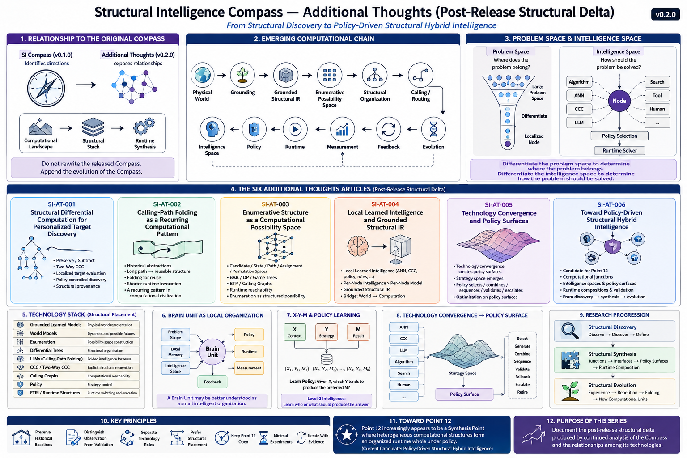

# Additional Thoughts

**Repository:** Structural Intelligence Compass
**Track:** Post-Release Structural Delta
**Version Context:** v0.2.0
**Status:** Active Research Extensions

---

## Purpose

This directory records post-release extensions to the **Structural Intelligence Compass**.

These articles do **not** replace, rewrite, or retroactively modify the original 12-Point Compass released in v0.1.0.

Instead, they document what became visible **after** the initial Compass had been established:

* missing upstream structural layers;
* new interpretations of existing SI mechanisms;
* technology convergence;
* Per-Node Intelligence Spaces;
* Policy Surfaces;
* Structural Synthesis;
* the emerging interpretation of Point 12.

The purpose is to preserve research provenance while allowing the Compass to continue evolving.

> **Do not rewrite the released Compass. Append the evolution of the Compass.**

---

# 1. Relationship to the Original Compass

The original Compass is a **research-direction artifact**.

It asks:

> Where should Structural Intelligence research look?

The Additional Thoughts series serves a different role.

It asks:

> What new structural relationships become visible when those directions are examined together?

This distinction is important.

```text
SI Compass
    |
    | identifies directions
    v
Additional Thoughts
    |
    | exposes relationships
    v
Computational Landscape
    |
    | organizes roles
    v
Structural Stack
    |
    | organizes cooperation
    v
Runtime Synthesis
```

The original Compass remains the historical baseline.

The Additional Thoughts layer records its continued growth.

---

# 2. Research Provenance

The v0.1.0 release should remain intact as a record of the research state at release time.

Post-release discoveries should not be inserted backward as though they had already been part of that baseline.

Instead:

```text
v0.1.0
12-Point Structural Intelligence Compass
        |
        | continued observation
        | continued structural analysis
        | technology convergence
        v
v0.2.0
Post-Release Structural Delta
```

This preserves an important research property:

> **The path by which a framework develops is itself useful evidence.**

Structural Intelligence should preserve its own structural provenance.

---

# 3. Compass, Landscape, and Stack

The Additional Thoughts series introduces an increasingly useful distinction among three complementary artifacts.

## 3.1 Compass

The **Compass** identifies research directions.

> **Compass tells us where to look.**

## 3.2 Computational Landscape

The **Landscape** identifies where different computational structures belong.

> **Landscape tells us where structures belong.**

## 3.3 Structural Stack

The **Stack** identifies how structures cooperate computationally.

> **Stack tells us how they work together.**

These are related but should not be collapsed into one artifact.

The original 12-Point Compass therefore does not need to be redrawn every time the computational landscape becomes more detailed.

---



**Fig-AT-000 — Structural Intelligence Compass — Additional Thoughts.**  
Post-release structural map of the v0.2.0 Additional Thoughts series. The figure
preserves the original 12-Point Compass as the research-direction baseline while
showing the emerging computational chain, the distinction between Problem Space
and Intelligence Space, the six SI-AT extensions, technology placement, Brain
Unit organization, X-Y-M policy learning, Policy Surfaces, and the progression
from Structural Discovery through Structural Synthesis toward Structural Evolution.

---

# 4. The Emerging Computational Chain

The Additional Thoughts articles increasingly expose a larger SI computational chain:

```text
Physical World
      |
      v
Grounding
      |
      v
Grounded Structural IR
      |
      v
Enumerative Possibility Space
      |
      v
Structural Organization
      |
      v
Calling / Routing
      |
      v
Intelligence Space
      |
      v
Policy
      |
      v
Runtime
      |
      v
Measurement
      |
      v
Feedback
      |
      v
Evolution
```

This chain should not yet be interpreted as a final SI ontology.

It is an emerging structural map.

Its value is that it clarifies the division of computational labor among many technologies that are often incorrectly treated as direct competitors.

---

# 5. From Paradigm Conflict to Structural Placement

Many AI debates are framed as competition:

```text
LLM vs World Model

Neural vs Symbolic

Learning vs Search

General Model vs Specialized Model
```

The SI perspective increasingly suggests another question:

> **Which computational job does each technology perform, and where should it be structurally placed?**

For example:

```text
Grounded Learned Models
    -> physical-world representation

World Models
    -> dynamics and possible futures

Enumeration
    -> possibility-space construction

Differential Trees
    -> structural organization

LLMs
    -> Calling-Path-Folded intelligence

CCC / Two-Way CCC
    -> explicit structural recognition

Calling Graphs
    -> computational reachability

Policy
    -> strategy control

FTRI / Runtime Structures
    -> runtime switching and execution
```

This leads to a useful principle:

> **Many AI paradigm conflicts are not conflicts of capability, but failures of structural placement.**

---

# 6. Additional Thoughts Series

The current series contains six articles.

---

## SI-AT-001 — Structural Differential Computation for Personalized Target Discovery

Explores personalized target discovery as a Structural Differential Computation problem.

Key themes:

* patient-specific structural differences;
* Differential Trees;
* Preserve / Subtract;
* Two-Way CCC;
* localized target evaluation;
* policy-controlled scientific discovery;
* structural provenance and validation.

The article uses personalized therapeutic target discovery as a motivating example while explicitly avoiding claims of demonstrated biomedical efficacy.

---

## SI-AT-002 — Calling-Path Folding as a Recurring Computational Pattern

Extends the interpretation of LLMs as **Calling-Path Folding**.

The article compares multiple historical computational abstractions, including:

* positional numerals;
* algebra;
* functions;
* libraries;
* APIs;
* compilation;
* machine learning;
* LLMs.

The mechanisms are not claimed to be mathematically equivalent.

The recurring structural pattern is:

```text
Long / Distributed Computational Path
                |
                v
Reusable Computational Structure
                |
                v
Shorter Runtime Invocation
```

The broader hypothesis is that Calling-Path Folding may represent a recurring mechanism in computational civilization.

---

## SI-AT-003 — Enumerative Structure as a Computational Possibility Space

Introduces **Enumerative Structure** as a candidate upstream SI layer.

It covers:

* candidate spaces;
* state spaces;
* path spaces;
* assignment spaces;
* permutation spaces;
* Branch-and-Bound;
* Dynamic Programming;
* game trees;
* BTP;
* Calling Graphs;
* runtime reachability.

The central principle is:

> **Advanced computation often does not eliminate enumeration; it organizes, compresses, bounds, reuses, or selectively traverses it.**

Enumeration is therefore treated not as brute force, but as the structural creation of computational possibility.

---

## SI-AT-004 — Local Learned Intelligence and Grounded Structural IR

Introduces two related but distinct layers.

### Local Learned Intelligence

Small specialized intelligence that can exist at a node:

* ANN;
* classifier;
* regressor;
* learned policy;
* local structural discriminator.

### Grounded Structural IR

The computational bridge from the physical world into Structural Intelligence:

```text
Physical World
      |
      v
Sensors
      |
      v
Learned Perception
      |
      v
Grounded Structural IR
```

The article also establishes an important distinction:

> **Per-Node Intelligence is broader than Per-Node Model.**

Learn-on-Demand intelligence may include ANN, Two-Way CCC, policy, rules, or other computational structures.

---

## SI-AT-005 — Technology Convergence and Policy Surfaces

Examines what happens when multiple mature computational technologies converge at the same runtime decision point.

The central principle is:

> **Technological convergence creates policy surfaces. Policy surfaces create optimization opportunities.**

A Policy Surface appears when multiple computational strategies become available:

```text
ANN
CCC
LLM
Algorithm
Search
Human
      |
      v
Strategy Space
      |
      v
Policy
```

Policy may:

* select;
* generate;
* combine;
* sequence;
* validate;
* fallback;
* escalate;
* retire.

This changes the problem from:

> Which technology is best?

to:

> **Which computational strategy is best here, under this policy?**

---

## SI-AT-006 — Toward Policy-Driven Structural Hybrid Intelligence

Acts as the synthesis article of the first Additional Thoughts series.

It develops a candidate interpretation of the still-open Point 12:

> **Policy-Driven Structural Hybrid Intelligence**

The article proposes that Point 12 may become a synthesis layer concerned with:

* computational junctions;
* intelligence spaces;
* policy surfaces;
* runtime compositions;
* validation paths;
* feedback loops;
* evolving computational organizations.

It introduces the larger research progression:

```text
Structural Discovery
        |
        v
Structural Synthesis
        |
        v
Structural Evolution
```

Point 12 remains intentionally open.

The article presents a candidate direction rather than a final definition.

---

# 7. The First Structural Delta

The first Additional Thoughts series produces several important extensions to the original Compass.

## 7.1 Enumerative Structure

Enumeration is recognized as an important upstream computational layer.

```text
Representation
      |
      v
Enumeration
      |
      v
Organization
```

This makes candidate, state, path, and permutation spaces explicit SI objects.

---

## 7.2 Grounded Structural IR

Physical-world AI requires a representation layer that converts sensor observations into computationally usable structure.

```text
World
  |
  v
Grounding
  |
  v
Structural IR
```

This connects SI to:

* World Models;
* spatial intelligence;
* robotics;
* autonomous systems;
* embodied AI.

---

## 7.3 Intelligence Space

A node should not necessarily be bound to one solver.

Instead:

```text
Node
 |
 v
Intelligence Space
 |
 +---- Algorithm
 +---- ANN
 +---- CCC
 +---- LLM
 +---- Search
 +---- Tool
 +---- Human
```

This creates a much richer interpretation of Per-Node Intelligence.

---

## 7.4 Learn-on-Demand Intelligence

A node may generate intelligence from local experience.

This may include:

```text
Train ANN

Construct Two-Way CCC

Learn Policy

Generate Rule

Build Index / Cache
```

Thus:

> **Learn-on-Demand is a general organizational capability, not an ANN-specific capability.**

---

## 7.5 Policy Surfaces

When multiple computational mechanisms become viable at the same junction, the system gains a strategy space.

```text
Technology Convergence
        |
        v
Strategy Enumeration
        |
        v
Policy Surface
```

This creates a new optimization domain.

---

## 7.6 Structural Synthesis

Research begins to move beyond discovering isolated structures.

The emerging methodology becomes:

```text
Existing Structures
       |
       v
Find Junctions
       |
       v
Define Interfaces
       |
       v
Expose Policy Knobs
       |
       v
Measure Tradeoffs
       |
       v
Optimize Composition
```

This is Structural Synthesis.

---

# 8. Problem Space and Intelligence Space

One of the strongest emerging patterns is the existence of two related spaces.

## Problem Space

```text
Large Problem Space
        |
        v
Differential Organization
        |
        v
Localized Node
```

## Intelligence Space

```text
Localized Node
       |
       v
Available Solvers
       |
       v
Policy Selection
```

Together:

```text
Problem Space
    |
    v
Differentiate
    |
    v
Node
    |
    v
Intelligence Space
    |
    v
Differentiate / Select
    |
    v
Runtime Solver
```

This produces a useful formulation:

> **Differentiate the problem space to determine where the problem belongs.**

> **Differentiate the intelligence space to determine how the problem should be solved.**

---

# 9. Per-Node Intelligence as a Local Organization

The Additional Thoughts series also expands the concept of a Brain Unit.

A Brain Unit need not be:

```text
Small Model
```

A richer interpretation is:

```text
Brain Unit
 |
 +---- Problem Scope
 |
 +---- Local Memory
 |
 +---- Intelligence Space
 |
 +---- Policy
 |
 +---- Runtime
 |
 +---- Measurement
 |
 +---- Feedback
```

Thus:

> **A Brain Unit may be better understood as a small intelligent organization.**

This provides a natural bridge between Localized Intelligence and Policy-Driven Organization.

---

# 10. X-Y-M and Policy Learning

A node may record:

```text
X = local context

Y = selected computational strategy

M = measured result
```

Repeated experience produces:

```text
(X1, Y1, M1)

(X2, Y2, M2)

...

(Xn, Yn, Mn)
```

This creates a local policy-learning problem:

> Given X, which Y tends to produce the preferred M?

This moves learning from:

```text
Learn the answer.
```

toward:

```text
Learn who or what should produce the answer.
```

This is a form of **Level-2 Intelligence**.

---

# 11. Point 12

Point 12 remains open by design.

The current candidate interpretation is:

> **Policy-Driven Structural Hybrid Intelligence**

But this should not yet be treated as a final locked definition.

The stronger current claim is:

> **Point 12 increasingly appears to be a Synthesis Point where heterogeneous computational structures begin to form an organized runtime whole.**

Its likely research objects include:

```text
Computational Junctions

Intelligence Spaces

Policy Surfaces

Runtime Compositions

Validation Paths

Feedback Loops

Evolving Organizational Structures
```

Further research and implementation should determine whether this candidate interpretation becomes the final Point 12 formulation.

---

# 12. Structural Discovery, Synthesis, and Evolution

The Additional Thoughts series suggests a broader SI research progression.

## Stage 1 — Structural Discovery

```text
Observe
   |
   v
Discover Structure
   |
   v
Define
```

Examples include:

* CCC;
* Two-Way CCC;
* Differential Trees;
* FTRI;
* Calling-Path Folding.

## Stage 2 — Structural Synthesis

```text
Multiple Structures
       |
       v
Junctions
       |
       v
Policy Surfaces
       |
       v
Runtime Composition
```

## Stage 3 — Structural Evolution

```text
Runtime Experience
       |
       v
Repeated Successful Structure
       |
       v
Folding / Learning
       |
       v
New Computational Unit
```

This progression is a research hypothesis.

It should be tested through future systems and experiments.

---

# 13. Research Discipline

The Additional Thoughts series should follow several principles.

## 13.1 Preserve Historical Baselines

Do not rewrite earlier releases to make them appear retrospectively complete.

## 13.2 Distinguish Observation From Validation

A strong structural hypothesis should not be described as experimentally proven before validation exists.

## 13.3 Separate Technology Roles

Do not force technologies into unnecessary winner-take-all comparisons.

## 13.4 Prefer Structural Placement

Ask:

```text
What computational job?

At what layer?

At which node?

Under which policy?
```

## 13.5 Keep Point 12 Open

Do not lock the synthesis layer before enough runtime evidence exists.

## 13.6 Prefer Minimal Experiments

Use small reference implementations to test structural claims before expanding system complexity.

---

# 14. What This Series Does Not Claim

The Additional Thoughts series does **not** claim that:

* the original Compass is obsolete;
* the SI ontology is complete;
* Point 12 has reached a final definition;
* all difficult computation is enumerative;
* Hybrid AI automatically improves intelligence;
* ANN, LLM, CCC, search, and World Models are interchangeable;
* policy optimization eliminates domain expertise;
* all SI hypotheses have been experimentally validated.

Instead, the series documents:

> **A post-release structural delta produced by continued analysis of the Compass and the relationships among its technologies.**

---

# 15. Suggested Reading Order

Readers interested in the main theoretical progression may begin with:

```text
SI-AT-003
Enumerative Structure
        |
        v
SI-AT-004
Local Learned Intelligence
and Grounded Structural IR
        |
        v
SI-AT-005
Technology Convergence
and Policy Surfaces
        |
        v
SI-AT-006
Toward Policy-Driven
Structural Hybrid Intelligence
```

This forms the main structural synthesis sequence.

Then read:

```text
SI-AT-001
Personalized Target Discovery
```

as an applied structural example.

And:

```text
SI-AT-002
Calling-Path Folding
```

as a broader computational and historical interpretation.

---

# 16. Current Series Index

| ID            | Title                                                                 | Primary Role                                                   |
| ------------- | --------------------------------------------------------------------- | -------------------------------------------------------------- |
| **SI-AT-001** | Structural Differential Computation for Personalized Target Discovery | Applied SI extension into scientific target discovery          |
| **SI-AT-002** | Calling-Path Folding as a Recurring Computational Pattern             | Generalizes Folding beyond LLMs                                |
| **SI-AT-003** | Enumerative Structure as a Computational Possibility Space            | Introduces an upstream SI structural layer                     |
| **SI-AT-004** | Local Learned Intelligence and Grounded Structural IR                 | Adds grounding and generalized Per-Node Intelligence           |
| **SI-AT-005** | Technology Convergence and Policy Surfaces                            | Introduces junctions, strategy spaces, and policy optimization |
| **SI-AT-006** | Toward Policy-Driven Structural Hybrid Intelligence                   | Synthesizes the emerging candidate direction for Point 12      |

---

# 17. Emerging Research Architecture

The first Post-Release Structural Delta can be summarized as:

```text
                  Physical World
                        |
                        v
                    Grounding
                        |
                        v
              Grounded Structural IR
                        |
                        v
                  Enumeration
                        |
                        v
                 Organization
                        |
                        v
                Calling / Routing
                        |
                        v
                 Brain Unit / Node
                        |
                        v
                Intelligence Space
          /        /       |       \        \
   Algorithm     ANN      CCC      LLM     Human
          \        \       |       /        /
                        |
                        v
                      Policy
                        |
                        v
                     Runtime
                        |
                        v
                     Measure
                        |
                        v
                    Feedback
                        |
                        v
                    Evolution
```

This is not yet the final Structural Intelligence architecture.

It is the **emerging computational landscape** exposed by the first Additional Thoughts series.

---

# 18. Looking Forward

Several next-step questions now become natural.

```text
How should Policy Surfaces be represented?

What is the minimal hybrid reference architecture?

How should Brain Units generate intelligence?

How should local and global policies interact?

How should runtime compositions be validated?

When should repeated runtime paths become new primitives?

How should Computational Intelligence Ecologies remain stable?
```

These questions point beyond the current Additional Thoughts series.

They should guide future experiments rather than be prematurely answered by architecture alone.

---

# 19. Closing Perspective

The original Structural Intelligence Compass asked where to look.

The Additional Thoughts series begins to reveal what happens when those directions are allowed to intersect.

The result is no longer merely a collection of isolated techniques.

A larger structure begins to appear:

```text
Possibility

Organization

Folding

Calling

Grounding

Localized Intelligence

Policy

Runtime

Feedback

Evolution
```

The most important change is methodological.

Structural Intelligence begins to move from:

> **discovering computational structures**

toward:

> **organizing computational structures**

and eventually toward:

> **allowing computational organizations to evolve.**

This transition can be summarized as:

> **Structural Discovery → Structural Synthesis → Structural Evolution**

The purpose of the Additional Thoughts series is to document that transition carefully, incrementally, and without rewriting the historical baseline from which it emerged.
