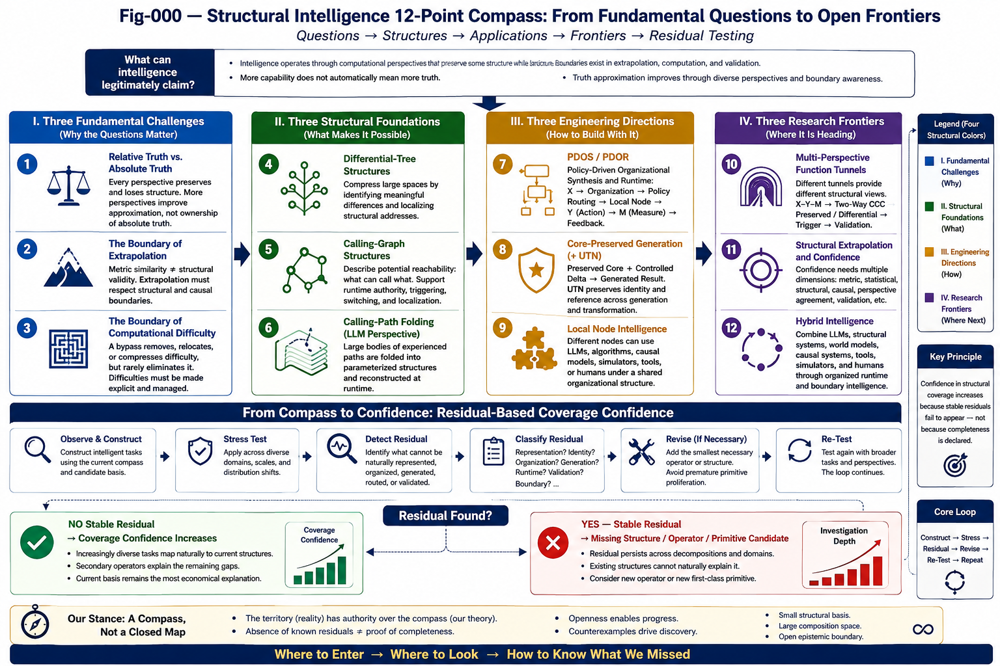

# SI-C-001 — The Structural Intelligence 12-Point Compass

## A Compact Research Framework for Questions, Structures, Engineering, and Open Frontiers

---

## Abstract

Artificial intelligence is increasingly discussed through individual technologies: Large Language Models, World Models, agents, causal models, symbolic systems, generative systems, software-generation systems, and hybrid architectures.

Each perspective reveals something important.

None should automatically be treated as a complete account of intelligence.

This paper proposes the **Structural Intelligence 12-Point Compass**, a compact research framework organized around four groups:

1. **Three Fundamental Challenges** — truth, extrapolation, and computational difficulty;
2. **Three Structural Foundations** — differential trees, Calling Graphs, and Calling-Path Folding;
3. **Three Engineering Directions** — PDOS/PDOR, Core-Preserved Generation, and Local Node Intelligence;
4. **Three Research Frontiers** — Multi-Perspective Function Tunnels, Structural Extrapolation, and Hybrid Intelligence.

The Compass is not proposed as a complete theory or final taxonomy.

It is a navigational framework.

Its purpose is to expose several questions that should remain visible when evaluating powerful computational systems.

A central conclusion is that greater intelligence may increase coverage, organization, validation, and adaptability without eliminating perspective or epistemic boundaries.

The twelfth point therefore returns to the first.

The Compass is a loop.

> **A more capable intelligence does not terminate the unknown. It reorganizes the boundary between the known and the unknown.**

# 1. Why a Structural Intelligence Compass?

Modern AI has become powerful enough that local success can easily be mistaken for global explanation.

A Large Language Model may solve an impressive reasoning problem.

A World Model may predict complex dynamics.

A causal model may support intervention.

A generative system may produce working software.

A quantum algorithm may bypass a computational barrier.

A hybrid architecture may combine many of these capabilities.

Each success matters.

But each success also creates a second question:

> **What exactly has been established?**

Has a general principle been discovered?

Has one computational path become efficient?

Has a model interpolated within a learned landscape?

Has a structural invariant been identified?

Has a difficult problem disappeared, or has its difficulty moved elsewhere?

Has another perspective been integrated, or has one perspective merely become larger?

These questions motivate the Structural Intelligence Compass.

The Compass is designed to prevent three common conceptual collapses:

**successful perspective → complete truth**

**successful extrapolation → unrestricted validity**

**successful bypass → disappearance of computational difficulty**

It then asks what computational structures may support broader intelligence and how those structures might be organized into practical systems.

---

# 2. Four Directions of the Compass

The twelve points form four groups.

| Group                           | Points | Central Question                                                    |
| ------------------------------- | ------ | ------------------------------------------------------------------- |
| **I. Fundamental Challenges**   | 1–3    | What are the boundaries of what computation can legitimately claim? |
| **II. Structural Foundations**  | 4–6    | What major structures organize intelligent computation?             |
| **III. Engineering Directions** | 7–9    | How can these structures become operational systems?                |
| **IV. Research Frontiers**      | 10–12  | Where may the next structural advances occur?                       |

At a higher level, the progression is:

**Epistemic Boundary**

→ **Computational Structure**

→ **Engineering Organization**

→ **Open Frontier**

But the progression does not terminate at Point 12.

Point 12 returns to Point 1.

---

---

---

# Part I — Three Fundamental Challenges

# 3. Point 1 — Relative Truth vs. Absolute Truth

Every intelligent computation reaches its result through something.

That something may be:

* an observation;
* a measurement;
* a representation;
* a dataset;
* a model;
* a coordinate system;
* an algorithm;
* a Function Tunnel;
* a learned parameter structure;
* a runtime context.

The result is therefore obtained through a **computational perspective**.

This does not make the result false.

A perspective can be extraordinarily accurate.

The important distinction is between:

> **a highly successful perspective**

and

> **a complete, lossless view of the underlying structure.**

These are not automatically equivalent.

---

## 3.1 The Single-Tunnel Problem

Consider a computational system operating through one Function Tunnel:

**Problem**

→ **Representation**

→ **Computational Tunnel**

→ **Result**

If the tunnel is powerful, its answers may be useful across an enormous range of cases.

But its success does not prove that alternative tunnels would expose no additional structure.

A useful analogy is a monkey reaching bananas through a particular chain of accessible paths.

The monkey may become extraordinarily effective at retrieving bananas available through that chain.

Its success establishes something important about that chain.

It does not establish that all bananas in the forest are reachable through it.

The computational analogue is:

> **Tunnel success may establish tunnel-relative truth without establishing perspective-independent completeness.**

---

## 3.2 Multiple Perspectives

Suppose several structurally different Function Tunnels examine the same problem:

**P1**

**P2**

**P3**

**P4**

Each may expose different information.

The important opportunity is not merely to vote among them.

It is to compare their structures.

Ask:

* What is preserved?
* What differs?
* Which differences correlate with outcomes?
* Which observations survive representation changes?
* Which conclusions depend strongly on one tunnel?
* Which structures recur across tunnels?

This suggests:

**Multiple Perspectives**

→ **Preserve / Subtract**

→ **Cross-Perspective Structure**

→ **Better Approximation**

The objective is not to declare that enough perspectives eventually guarantee Absolute Truth.

The objective is more modest and computationally useful:

> **Structurally different perspectives can expose one another's blind regions and improve approximation of underlying structure.**

---

## 3.3 Observation as Perspective

This issue extends beyond AI.

In many classical physical settings, measurement can approximately be treated as a passive observation whose effect on the measured system is negligible at the relevant scale.

At microscopic scales, this assumption becomes much more difficult to maintain.

Quantum measurement provides a particularly sharp reminder that measurement context and accessible information cannot always be treated as a transparent, lossless reading of a pre-existing classical state.

The Structural Intelligence argument does not depend on adopting any particular interpretation of quantum mechanics.

The narrower point is sufficient:

> **When access to a system is necessarily selective, contextual, or intervention-bearing, observation should not automatically be identified with the whole underlying structure.**

This motivates a general principle:

## Perspective-Loss Principle

> **A computational or observational perspective may preserve important structure while losing other structure.**

And therefore:

## Cross-Perspective Recovery Principle

> **When no single perspective can be assumed to be structurally lossless, comparing multiple perspectives may recover stronger invariants and expose otherwise hidden differences.**

---

# 4. Point 2 — The Boundary of Extrapolation

Machine learning often frames extrapolation geometrically or statistically.

Observed data occupy a region.

A model learns a function over that region.

Confidence generally becomes weaker as new cases move outside the observed distribution.

This is reasonable for many statistical relationships.

But not all useful relationships are governed primarily by metric continuity.

---

## 4.1 Metric Extrapolation

Metric extrapolation asks:

> **How far is the new X from previously observed X?**

This is important.

But it is not sufficient.

---

## 4.2 Structural Extrapolation

Structural extrapolation asks:

> **Which relevant structures remain preserved when X changes?**

Two cases may be metrically close yet structurally different.

Two cases may be metrically distant yet preserve the same important mechanism.

Consider two mechanically similar structures:

* a simply supported beam;
* a cantilever beam.

Material properties may be similar.

Dimensions may be similar.

Loads may be similar.

Metric distance may therefore be small.

Yet one boundary condition has changed.

That structural difference can radically change the correct physical analysis.

The reverse can also occur.

Two situations may look very different in raw measurement space while preserving a strong causal mechanism.

---

## 4.3 Causal and Triggering Extrapolation

Competitive markets provide many examples.

A new market state may never have appeared historically.

Its metric coordinates may lie far outside previous observations.

Yet a causal or strategic trigger may remain meaningful:

**Competitor Action**

→ **Changed Incentive**

→ **Customer Response**

→ **Required Counteraction**

The important question is therefore not simply whether the new state resembles previous data.

It is:

> **Does the relevant structural or causal relation remain valid?**

This motivates deeper work on **Structural Extrapolation Confidence**.

---

# 5. Point 3 — The Boundary of Computational Difficulty

A powerful new computational technique often creates a dangerous inference:

> **This difficult problem has been bypassed; therefore computational difficulty itself is disappearing.**

That conclusion does not follow.

Computational difficulty belongs to particular structures.

A new method may transform one structure without eliminating another.

---

## 5.1 Quantum Computing

Quantum computing provides a useful example.

A quantum algorithm may dramatically alter the practical difficulty of a particular mathematical problem.

That does not imply that every difficult computational problem becomes easy.

Breaking a cryptographic mechanism based on one mathematical hardness assumption does not imply that every cryptographic construction based on a different hardness structure collapses for the same reason.

The relevant question is:

> **Which computational structure has actually been bypassed?**

---

## 5.2 AI Coding

The same issue appears in AI Coding.

Generative AI can dramatically reduce:

**Code Generation Cost**

But this does not automatically reduce:

**State-Space Complexity**

or:

**Validation Complexity**

or:

**Unknown Runtime Behavior**

A system capable of generating millions of lines of code does not thereby obtain exhaustive knowledge of every reachable state of the resulting software.

Generating more tests does not guarantee exhaustive validation when the underlying state space is non-enumerable or combinatorially explosive.

Therefore:

> **Generation difficulty, execution difficulty, and validation difficulty must remain conceptually separate.**

---

## 5.3 Difficulty Accounting

When evaluating a computational breakthrough, the Compass asks:

1. What difficulty disappeared?
2. What difficulty was bypassed?
3. What difficulty was compressed?
4. What difficulty was relocated?
5. What difficulty remains?

This is **structural difficulty accounting**.

It prevents a local computational victory from being misinterpreted as a universal one.

---

# Part II — Three Structural Foundations

# 6. Point 4 — Differential-Tree Structures

Intelligence frequently operates over spaces too large to search uniformly.

One solution is organization through difference.

A Differential Tree progressively separates objects, states, or knowledge according to meaningful distinctions.

At a high level:

**Open X-Space**

→ **Difference**

→ **Difference of Differences**

→ **Localized Structural Region**

→ **Address**

This creates **Organizational Compression**.

Instead of comparing every new X against everything known, the system progressively narrows the relevant structural neighborhood.

---

## 6.1 Difference Before Label

A Differential Tree need not begin as a classification tree.

Its initial purpose can be more primitive:

> **Organize what is structurally different from what.**

Labels, policies, behaviors, or semantic classes may later be projected onto this organization.

This distinction is important.

**Difference**

is not identical to:

**Classification**

and classification is not identical to:

**Behavior**.

Structural organization can exist before either.

---

## 6.2 From Organization to Runtime Address

Once differential structure exists, it can support:

* localization;
* naming;
* routing;
* classification projection;
* behavioral projection;
* policy application;
* local memory;
* local learning.

Thus a Differential Tree can become more than an index.

It can become part of a computational organization.

---

# 7. Point 5 — Calling-Graph Structures

A static collection of computational capabilities does not define runtime intelligence.

A second structural question is:

> **What can call what?**

A Calling Graph represents potential computational reachability.

Nodes may represent:

* functions;
* models;
* tools;
* agents;
* local intelligence units;
* memories;
* policies;
* human participants.

Edges represent possible computational relationships.

---

## 7.1 Potential Structure vs. Runtime Structure

A Calling Graph describes potential computation.

At runtime, only part of the graph may become active.

Therefore:

**Potential Calling Graph**

≠

**Runtime Calling Structure**

This distinction introduces:

* runtime authority;
* selective reachability;
* triggering;
* switching;
* policy;
* local activation;
* runtime isolation.

These mechanisms are central to efficient and controllable intelligent systems.

---

## 7.2 Organization Is Not Full Connectivity

Intelligence does not necessarily improve by allowing every component to communicate with every other component at all times.

Full connectivity can increase:

* cost;
* interference;
* ambiguity;
* security risk;
* validation difficulty.

Selective Calling Graphs can instead create:

> **structured computational reachability.**

This is a major foundation for Runtime Structural Intelligence.

---

# 8. Point 6 — Calling-Path Folding

Large Language Models appear very different from explicit Calling Graphs.

Structurally, however, another interpretation is possible.

Language, code, reasoning patterns, associations, transformations, and responses expose enormous numbers of experienced computational paths.

Training folds these relationships into parameterized structures.

At runtime, the model can reconstruct or generate useful paths without explicitly replaying the original experience.

This can be viewed as:

## Calling-Path Compression

**Massive Experience**

→ **Massive Calling Paths**

→ **Parameterized Folding**

→ **Runtime Reconstruction / Generation**

---

## 8.1 Why LLMs Are So Broad

This perspective helps explain an important feature of LLMs.

Their power does not necessarily arise because one explicit symbolic reasoning algorithm has been discovered.

Their power can arise because an enormous number of useful paths have been compressed into one highly reusable computational structure.

The breadth is real.

But the compression creates limitations.

The original local paths are not necessarily preserved as independently addressable structures.

This can make:

* exact provenance;
* local reconstruction;
* isolation;
* local modification;
* structural explanation

difficult.

The same compression that creates extraordinary convenience can reduce explicit structural addressability.

---

## 8.2 Three Different Structural Foundations

The first three major structural mechanisms can therefore be summarized as:

### Differential Trees

Compress **difference and search space**.

### Calling Graphs

Organize **potential computational reachability**.

### Calling-Path Folding

Compress **experienced computational paths**.

These are not identical structures.

They solve different organizational problems.

---

# Part III — Three Engineering Directions

# 9. Point 7 — PDOS / PDOR

Differential organization becomes substantially more powerful when connected to runtime decision making.

**Policy-Driven Organizational Synthesis (PDOS)** and **Policy-Driven Organizational Runtime (PDOR)** explore this transition.

The central pipeline is:

**X**

→ **Differential Organization**

→ **Policy-Driven Routing**

→ **Local Node**

→ **Decision**

→ **Y**

→ **Measure M**

→ **Feedback**

The local node can retain:

**X–Y–M**

experience.

Over time, organization becomes connected to localized runtime intelligence.

---

## 9.1 Organizational Compression

PDOS/PDOR can be interpreted as a major form of compression:

**Large X-Space**

→ **Differential Organization**

→ **Localized Runtime Address**

Rather than asking one universal intelligence mechanism to process every case identically, the system first determines:

> **Where should this computation occur?**

This transforms organization into computation.

---

## 9.2 Organization Before Intelligence Mechanism

The node does not need to use one universal decision engine.

Different nodes may use different methods.

This separates:

**Where computation belongs**

from:

**How local computation is performed**.

That separation becomes important in Point 9.

---

# 10. Point 8 — Core-Preserved Generation

Generative intelligence faces a different compression problem.

The output space may be enormous.

The system must produce something new while preserving something essential.

This suggests:

## Core-Preserved Generative Compression

**Large Generative Space**

→ **Preserved Core**

* **Controlled Delta**

→ **Generated Result**

The central question is:

> **What must remain invariant while generation is allowed to vary?**

---

## 10.1 Core-Preserved Generation for AI Coding

AI Coding provides a direct example.

A software system may permit enormous variation in:

* implementation;
* naming;
* local optimization;
* internal decomposition;
* code style.

But some structures must remain preserved:

* API contracts;
* data semantics;
* security constraints;
* required behavior;
* architectural boundaries;
* certified invariants.

Generation becomes safer when these structures are treated as preserved computational cores rather than merely as natural-language preferences.

---

## 10.2 UTN as a Key Secondary Structure

Core preservation requires more than knowing that "something" should remain unchanged.

The preserved structure must be identifiable.

It must be possible to determine:

* what the object is;
* what structural role it has;
* which core is being referenced;
* how generated variants correspond to the same or different structural entities;
* where the object belongs in a larger computational organization.

This is where **Universal Typing and Naming (UTN)** becomes especially important.

UTN can provide a structural identity and addressing layer:

**Object**

→ **Type**

→ **Name**

→ **Structural Position**

→ **Referenceable Core**

Within Core-Preserved Generation, UTN can help stabilize the identity of what generation is required to preserve.

It therefore acts as an important secondary structure connecting:

**representation**

→ **structural identity**

→ **preserved core**

→ **controlled generation**.

UTN is not itself identical to Core-Preserved Generation.

Rather, it can provide one of the critical structural infrastructures that makes reliable core preservation possible.

---

## 10.3 Beyond Coding

The same principle may extend to:

* architecture generation;
* workflow generation;
* policy generation;
* model generation;
* engineering design;
* scientific hypothesis construction.

The general structure remains:

> **Preserve what defines the object while allowing controlled variation in what does not.**

---

# 11. Point 9 — Local Node Intelligence

Organization answers:

> **Where should computation happen?**

It does not completely answer:

> **What should happen there?**

A local node therefore requires an intelligence mechanism appropriate to its local problem.

Possible mechanisms include:

* LLM;
* Two-Way CCC;
* probabilistic decision engine;
* deterministic algorithm;
* rule system;
* simulator;
* World Model;
* external tool;
* human;
* hybrid mechanism.

---

## 11.1 Heterogeneous Intelligence

This suggests a major architectural principle:

> **Shared organization does not require shared intelligence implementation.**

A system can have one runtime organization while permitting heterogeneous local intelligence.

This may be important for Digital Brain architectures.

Biological brains do not obviously require every local region to perform identical computation.

Likewise, computational brains may benefit from specialized local structures operating within a shared organizational runtime.

---

## 11.2 Secondary Structural Operators

Local intelligence can be supported by relatively small reusable operators.

Examples include:

### Two-Way CCC

Compare two structures through:

**Preserve**

and:

**Subtract**

to expose structural commonality and difference.

### Variable-Size Block Index

Provide adaptable structural addressing over information blocks whose useful boundaries need not have fixed size.

### UTN

Provide typing, naming, structural identity, and referenceable organization.

### Function Tunnels

Represent reusable computational channels.

### Runtime Invariants

Preserve important structure across runtime variation.

### Triggering and Switching

Select which computation should become active.

### X–Y–M Memory

Connect state, decision, and measured outcome.

These mechanisms need not become separate first-class theories of intelligence.

Their importance may lie in how economically they compose.

---

# Part IV — Three Research Frontiers

# 12. Point 10 — Multi-Perspective Function Tunnels

If one Function Tunnel provides one computational perspective, a natural next step is to compare multiple tunnels.

The objective is not merely ensemble voting.

The deeper objective is structural comparison.

Suppose runtime experience produces:

**X → Y → M**

Initially, similar X may appear to support one Y.

With additional experience, however, the system may observe:

**X → Y1 → M1**

**X → Y2 → M2**

**X → Y3 → M3**

The same broad structural region now contains multiple outcomes.

This creates an opportunity.

---

## 12.1 From Multi-Valued Experience to Trigger Discovery

The progression may be:

### Stage A

**Single-Valued X–Y–M**

### Stage B

**Multi-Valued X–Y–M**

### Stage C

Group cases by outcome.

### Stage D

Apply Two-Way CCC across outcome groups.

### Stage E

Identify preserved and distinguishing structures.

### Stage F

Generate candidate trigger conditions.

### Stage G

Validate future runtime decisions.

This produces:

**Experience**

→ **Structural Difference**

→ **Trigger Hypothesis**

→ **Runtime Validation**

Two-Way CCC therefore may move from recognition toward **generative triggering**.

---

## 12.2 Multiple Function Tunnels as Perspective Diversity

Different Function Tunnels may expose different dimensions of the same runtime problem.

One may emphasize:

* metric similarity;

another:

* causal structure;

another:

* historical outcome;

another:

* local policy;

another:

* simulation.

Cross-tunnel comparison can then ask:

> **Which trigger remains credible across structurally different perspectives?**

This may improve decision confidence without requiring any one tunnel to become universally authoritative.

---

# 13. Point 11 — Structural Extrapolation and Confidence

Point 2 raises the extrapolation problem.

Point 11 turns it into a research program.

Current intelligent systems often compress confidence into one scalar.

But different forms of confidence can disagree.

A future Structural Intelligence system may need to distinguish:

### Metric Confidence

How close is the new case to previous observations?

### Statistical Confidence

How strongly does the observed dataset support the prediction?

### Structural Confidence

Are the relevant structural invariants preserved?

### Causal Confidence

Does the mechanism supporting the inference remain active?

### Runtime Validation Confidence

Has this type of decision survived actual runtime feedback?

---

## 13.1 When Confidence Dimensions Disagree

Consider:

**High Metric Confidence**

but:

**Low Structural Confidence**

The case looks familiar, but an important boundary condition has changed.

This may be dangerous.

Now consider:

**Low Metric Confidence**

but:

**High Structural Confidence**

The case is historically unusual, but a strongly validated mechanism remains preserved.

This may justify extrapolation.

Such distinctions are especially important for:

* engineering;
* scientific reasoning;
* market competition;
* autonomous systems;
* software operation;
* Hybrid AI.

---

## 13.2 Confidence as Structure

Confidence may therefore become less like:

**one number attached to an answer**

and more like:

**a structured description of why the answer should remain valid.**

This is a major open research direction.

---

# 14. Point 12 — Hybrid Intelligence

The future of AI is unlikely to consist of one mechanism doing everything.

A practical intelligent system may contain:

* LLMs;
* Structural Intelligence;
* World Models;
* causal models;
* symbolic systems;
* tools;
* simulators;
* search;
* local decision engines;
* humans;
* future computational mechanisms.

Simply connecting these components does not create coherent intelligence.

The central problem becomes organizational.

---

## 14.1 The Hybrid Runtime Question

A Hybrid Intelligence system must answer:

* Who gets runtime authority?
* Under what condition?
* Through which Calling Path?
* Which structure must be preserved?
* Which local intelligence should be used?
* What happens when two systems disagree?
* Who validates the result?
* When should another perspective be requested?
* When should the system return "unknown"?
* How does runtime experience change future organization?

Thus:

> **Hybrid Intelligence is not merely model aggregation. It is runtime organization across heterogeneous forms of intelligence.**

---

## 14.2 Structural Intelligence as Organizational Infrastructure

Structural Intelligence may contribute:

**Differential Organization**

**Calling Graphs**

**Function Tunnels**

**Runtime Invariants**

**UTN**

**Triggering**

**Switching**

**X–Y–M**

**Local Node Intelligence**

**Feedback**

**Validation**

These structures can help determine how heterogeneous computational capabilities cooperate without requiring them to become one homogeneous model.

---

# 15. Point 12 Returns to Point 1

Suppose Point 12 succeeds extraordinarily well.

Imagine a future system combining:

**LLM**

* **World Model**

* **Structural Intelligence**

* **Causal Reasoning**

* **Simulation**

* **Tools**

* **Human Knowledge**

* **Runtime Validation**

Its coverage may be vastly greater than that of any current system.

Its reliability may improve dramatically.

Its ability to discover new perspectives may itself become highly advanced.

Does it now own Truth?

No such conclusion follows.

The system still operates through:

* finite observations;
* finite representations;
* finite computational structures;
* finite perspectives;
* finite validation history.

Therefore:

**More Perspectives ≠ All Perspectives**

**Better Coverage ≠ Complete Coverage**

**General Intelligence ≠ Omniscience**

Point 12 returns to Point 1.

---

# 16. AGI as Capability Rather Than Truth Ownership

This distinction matters for the concept of Artificial General Intelligence.

AGI can reasonably be evaluated by properties such as:

* breadth of useful capability;
* adaptability;
* reliability;
* learning efficiency;
* task coverage;
* ability to use tools;
* ability to cooperate;
* ability to recognize uncertainty;
* ability to acquire new perspectives;
* ability to revise previous conclusions.

These are meaningful capability measures.

They do not require AGI to possess a final model of reality.

In this sense, AGI is better understood as a **general capability concept** than as a certificate of epistemic completion.

---

# 17. Boundary Intelligence

A mature intelligent system should not merely know things.

It should increasingly represent:

**What do I know?**

**From which perspective do I know it?**

**Under what conditions is it valid?**

**What evidence supports it?**

**What would invalidate it?**

**How far am I extrapolating?**

**Which alternative perspectives disagree?**

**What remains unknown?**

This motivates:

## Boundary Intelligence

> **Boundary Intelligence is the capability of an intelligent system to recognize, represent, test, communicate, and expand the validity boundaries of its own knowledge and computation.**

Boundary Intelligence does not eliminate the unknown.

It makes the unknown computationally actionable.

---

## 17.1 Unknown as a Runtime State

If a system detects that it has crossed a reliable boundary, the result need not be forced confidence.

It may trigger:

**Another Function Tunnel**

or:

**Another Local Node**

or:

**Another Model**

or:

**A Tool**

or:

**A Simulation**

or:

**Additional Data**

or:

**Human Review**

or:

**New Structural Validation**

Thus:

> **Unknown can become a trigger rather than a failure.**

This connects epistemic boundaries directly to runtime architecture.

---

# 18. Three Major Compression Structures

Looking across the Compass reveals another possible pattern.

A surprisingly broad range of intelligent computation may involve three major compression structures.

---

## 18.1 Organizational Compression

Associated strongly with differential organization and PDOS/PDOR:

**Large X-Space**

→ **Differential Structure**

→ **Localized Address**

It answers:

> **Where?**

---

## 18.2 Core-Preserved Generative Compression

Associated with CG and supported by structures such as UTN:

**Large Generative Space**

→ **Referenceable Preserved Core**

* **Controlled Delta**

→ **Generated Structure**

It answers:

> **What must remain while something new is generated?**

---

## 18.3 Calling-Path Compression

Associated strongly with LLMs:

**Large Experience Space**

→ **Folded Calling Paths**

→ **Runtime Reconstruction**

It answers:

> **What useful computational experience can be compressed and reused?**

---

# 19. A Minimal Structural Basis Hypothesis

These observations suggest a hypothesis:

> **Broad intelligence may require fewer first-class structural primitives than its behavioral complexity suggests.**

The hypothesis is intentionally cautious.

It does not state that exactly three compression structures exist.

It does not state that Two-Way CCC, UTN, Variable-Size Block Index, FT, RI, or other secondary mechanisms exhaust the operator space.

It does not claim mathematical completeness.

It states something more limited:

> **After substantial structural exploration, a relatively small family of major compression structures appears capable of supporting an unexpectedly broad range of intelligent computation.**

That observation deserves testing.

---

# 20. From Primitive Discovery to Basis Stress Testing

A natural research reaction would be to continue searching for a fourth major structure.

But this may no longer be the strongest method.

A better question is:

> **Can we find an intelligent task that cannot be naturally decomposed using the current structural basis?**

This changes the research program.

Instead of:

**Invent another primitive**

we perform:

**Basis Stress Testing**.

Candidate domains include:

* scientific discovery;
* mathematics;
* robotics;
* market competition;
* vision;
* language;
* long-horizon planning;
* software engineering;
* organizational intelligence;
* World Models;
* biological intelligence.

---

# 21. Residual Intelligence

For each domain, attempt to construct the required intelligence using:

* organizational compression;
* core-preserved generation;
* calling-path compression;
* local operators;
* memory;
* triggering;
* switching;
* feedback;
* validation.

Then examine what remains.

That remainder can be called:

## Residual Intelligence

> **Residual Intelligence is the portion of an intelligent task that cannot yet be naturally represented, organized, generated, routed, learned, triggered, executed, or validated using the current structural basis.**

If stable residuals appear repeatedly, they may indicate:

* missing representations;
* missing runtime structures;
* missing operators;
* incorrect decomposition;
* or genuinely missing first-class primitives.

A fourth primitive should ideally be discovered because reality demands it, not because a framework looks aesthetically incomplete without it.

---

# 22. Toward a Digital Brain

The same structural convergence has implications for Digital Brain architectures.

A Digital Brain need not necessarily consist of a large number of unrelated intelligence mechanisms.

A candidate architecture may instead emerge from:

## Major Structures

**Organizational Compression**

**Core-Preserved Generation**

**Calling-Path Compression**

combined with:

## Secondary Structures

**Two-Way CCC**

**UTN**

**Variable-Size Block Index**

**Differential Trees**

**Function Tunnels**

**Runtime Invariants**

**Calling Graphs**

**Triggering / Switching**

**X–Y–M Memory**

**Feedback / Validation**

and organized through:

## Runtime Structure

**Policy**

→ **Routing**

→ **Local Intelligence**

→ **Action**

→ **Measurement**

→ **Feedback**

→ **Structural Update**

The behavioral complexity of such a system may be enormous even if its fundamental structural vocabulary remains relatively small.

This is consistent with **Operator Economy**.

---

# 23. Computational Basis and Open Truth Are Compatible

A minimal computational basis should not be confused with a closed epistemic basis.

These two propositions can coexist:

> **Computational primitives may converge.**

and:

> **Epistemic boundaries may remain open.**

A Digital Brain may eventually operate through a relatively stable architecture.

That does not imply that its knowledge becomes complete.

Indeed, stable computational primitives may be precisely what allow an intelligence to continue learning across an open future.

The machine can become structurally economical while the world remains structurally inexhaustible.

---

# 24. The 12-Point Compass as a Research Instrument

The Compass should therefore be used diagnostically.

When evaluating an intelligent system, ask:

### Truth

What perspective produced the result?

### Extrapolation

Where does structural validity end?

### Difficulty

What computational hardness remains?

### Differential Structure

How is the problem space organized?

### Calling Graph

What computation is reachable?

### Calling-Path Folding

What experience has been compressed?

### PDOS / PDOR

Where should computation occur?

### Core-Preserved Generation

What must remain invariant during generation?

### Local Node Intelligence

What computation should occur locally?

### Multi-Perspective FT

What do alternative computational perspectives reveal?

### Structural Confidence

Why should the result remain valid?

### Hybrid Intelligence

How are heterogeneous intelligence mechanisms organized?

Then ask Point 1 again.

---

# 25. What the Compass Does Not Claim

The Structural Intelligence Compass does not claim:

* that twelve points are complete;
* that three compression structures are mathematically exhaustive;
* that Structural Intelligence replaces LLMs;
* that LLMs can be reduced entirely to Calling-Path Folding;
* that all causality extrapolates;
* that all structural similarity is reliable;
* that Hybrid AI becomes truth-complete;
* that AGI eliminates uncertainty;
* that a Digital Brain architecture has been completed;
* that another first-class primitive cannot exist.

The Compass is intentionally open to all of these possibilities being challenged.

---

# 26. Collective Learning

The Compass is being presented before every direction has been fully developed.

This is deliberate.

A useful research direction should not necessarily remain private until its entire territory has been mapped.

Early publication allows others to:

* test it;
* reject it;
* reinterpret it;
* find counterexamples;
* apply it elsewhere;
* discover missing directions.

This is particularly important for an open-boundary research framework.

> **A theory that asks the future to remain open should itself remain open to the future.**

---

# 27. Closing Perspective

The Structural Intelligence 12-Point Compass begins with a question about truth.

It passes through extrapolation and computational difficulty.

It then examines differential organization, Calling Graphs, and Calling-Path Folding.

It moves into PDOS/PDOR, Core-Preserved Generation, and Local Node Intelligence.

It looks forward toward Multi-Perspective Function Tunnels, Structural Extrapolation, and Hybrid Intelligence.

Then it returns to the beginning.

That return is essential.

No amount of computational sophistication automatically transforms a perspective into the whole.

No amount of hybridization guarantees epistemic completion.

No minimal computational basis implies a minimal world.

Intelligence may become increasingly general while remaining structurally open.

And that may be one of its most important properties.

> **Intelligence does not terminate the unknown. It reorganizes the boundary between the known and the unknown.**

The objective of the Compass is therefore not to close the field.

It is to help identify where to look next.

---

## Structural Intelligence 12-Point Compass

### Three Fundamental Challenges

1. **Relative Truth vs. Absolute Truth**
2. **The Boundary of Extrapolation**
3. **The Boundary of Computational Difficulty**

### Three Structural Foundations

4. **Differential-Tree Structures**
5. **Calling-Graph Structures**
6. **Calling-Path Folding**

### Three Engineering Directions

7. **PDOS / PDOR**
8. **Core-Preserved Generation**
9. **Local Node Intelligence**

### Three Research Frontiers

10. **Multi-Perspective Function Tunnels**
11. **Structural Extrapolation and Confidence**
12. **Hybrid Intelligence**

### And Then

**Point 12 → Point 1**

---

**A compass, not a closed map.**

**View → Boundary → Basis → Invitation**

> **If the Compass is useful, use it. If it misses a direction, help identify it.**
