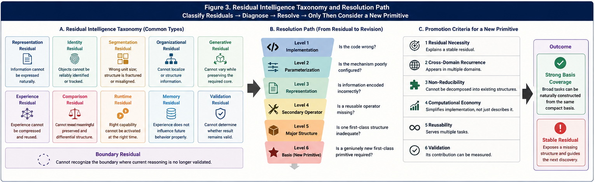

# SI-C-003 — A Minimal Structural Basis for Broad Intelligence

## From Major Compression Structures to Operator Economy and Digital Brain Architecture

---

## Abstract

Broad intelligent behavior appears extraordinarily complex.

Language, perception, reasoning, planning, coding, decision making, scientific discovery, market response, organizational behavior, and adaptive control seem to require very different forms of computation.

A natural assumption is therefore that broad intelligence must depend on a correspondingly large number of fundamental intelligence mechanisms.

This paper examines a different possibility.

Across several Structural Intelligence research directions, three major forms of computational compression repeatedly appear:

1. **Organizational Compression** — large state spaces are reduced through structural differentiation and localized addressing;
2. **Core-Preserved Generative Compression** — enormous generative spaces are controlled by preserving a referenceable structural core while allowing bounded variation;
3. **Calling-Path Compression** — large bodies of experienced computational relationships are folded into reusable runtime capability.

These three structures are associated respectively with differential organization and PDOS/PDOR, Core-Preserved Generation, and Large Language Models viewed through Calling-Path Folding.

Around them appears a smaller class of secondary structural mechanisms, including Two-Way CCC, Universal Typing and Naming (UTN), Variable-Size Block Index, Function Tunnels, Runtime Invariants, triggering and switching, Calling Graphs, X–Y–M memory, feedback, and validation.

This motivates the **Minimal Structural Basis Hypothesis**:

> **Broad intelligence may require fewer first-class structural primitives than its behavioral complexity suggests.**

The hypothesis is not a completeness claim.

No proof is offered that exactly three major compression structures exist, nor that another first-class primitive cannot be discovered.

The stronger research program is therefore not to defend the proposed basis, but to stress-test it across increasingly diverse intelligent tasks and search explicitly for **Residual Intelligence**.

If the basis survives broad stress testing, it may provide a compact foundation for Digital Brain architectures.

If stable residuals remain, they may reveal the next genuinely necessary computational primitive.

---

# 1. The Complexity Paradox of Intelligence

Intelligent behavior looks complicated.

A capable agent may need to:

* recognize;
* classify;
* retrieve;
* reason;
* predict;
* generate;
* plan;
* decide;
* route;
* switch;
* validate;
* learn;
* adapt.

It is therefore tempting to assume:

> **Many intelligent behaviors require many fundamentally different intelligence primitives.**

But this inference is not necessary.

Complex behavior can emerge from a small basis.

Digital computers provide an obvious lesson.

Extremely diverse applications arise from relatively economical primitive operations combined through:

* composition;
* memory;
* hierarchy;
* control;
* runtime state.

The relevant question for intelligence may therefore be:

> **How much intelligent behavior can be generated from how small a reusable structural basis?**

This is the question of **Operator Economy**.

---

# 2. From Primitive Discovery to Structural Convergence

Structural Intelligence research initially produces the impression of expanding primitive diversity.

Different problems expose different structures:

* Common Concept Core;
* Two-Way CCC;
* differential trees;
* Function Tunnels;
* Runtime Invariants;
* Calling Graphs;
* runtime switching;
* X–Y–M memory;
* organizational routing;
* Core-Preserved Generation;
* Universal Typing and Naming;
* Variable-Size Block Index.

But a second pattern gradually becomes visible.

Many of these mechanisms may not represent independent first-class forms of intelligence.

Instead, they appear to support a smaller number of major structural operations.

This suggests a distinction between:

## First-Class Structural Mechanisms

Large-scale computational structures that solve fundamentally different compression or organization problems.

and:

## Secondary Structural Operators

Reusable mechanisms that support identification, comparison, addressing, switching, preservation, local decision making, and validation inside those larger structures.

This distinction is central to the Minimal Structural Basis Hypothesis.

---

# 3. What Counts as a Major Structural Basis?

A candidate first-class structure should satisfy more than local usefulness.

It should address a broad and recurring computational problem.

It should support many applications.

It should not be naturally reducible to a smaller operator already present in another major structure.

It should materially change how a large intelligent state space is represented or computed.

Using this criterion, three major compression structures currently appear especially important.

---

# 4. Major Structure I — Organizational Compression

The first problem of intelligence is often not:

> **What is the answer?**

but:

> **Where does this problem belong?**

A large state space cannot always be processed efficiently as one undifferentiated domain.

Organizational Compression addresses this by progressively exposing differences.

At a high level:

**Large X-Space**

→ **Differential Organization**

→ **Localized Structural Region**

→ **Runtime Address**

This turns a large open space into a computational organization.

---

# 5. Differential Organization

A Differential Tree separates states through meaningful differences.

The important point is that difference can precede classification.

The structure may first answer:

> **What is structurally different from what?**

Only later may semantic or behavioral projections be added.

Therefore:

**Difference**

≠ **Classification**

and:

**Classification**

≠ **Behavior**

A structural organization can exist before either classification or policy is imposed.

This permits the same underlying organization to support multiple downstream interpretations.

---

# 6. Organizational Compression as Search Reduction

Suppose an intelligent system contains a very large number of possible local structures.

Without organization, a new X may require broad comparison across the entire system.

Differential organization transforms this into progressive narrowing.

Instead of:

**X → Compare Against Everything**

the system performs:

**X**

→ **Difference Test**

→ **Branch**

→ **Further Difference**

→ **Localized Node**

The computational gain is not merely storage efficiency.

It is **runtime addressability**.

---

# 7. PDOS / PDOR as Runtime Organizational Compression

Policy-Driven Organizational Synthesis and Runtime extend structural organization into computation.

The pipeline becomes:

**X**

→ **Differential Organization**

→ **Policy Projection**

→ **Routing**

→ **Local Node**

→ **Decision Y**

→ **Measure M**

→ **Feedback**

This connects organization to runtime intelligence.

The key compression is:

> **A global state space becomes a locally actionable computational address space.**

Rather than requiring one universal decision mechanism to process every state identically, the system first determines where the state belongs.

---

# 8. Organization as a Computational Primitive

This suggests a deeper proposition:

> **Organization itself can perform computation.**

A routing decision is already computational.

A structural branch excludes irrelevant alternatives.

A local node changes the available decision landscape.

Thus:

**Organization**

is not merely preparation for intelligence.

It can be part of intelligence.

This makes Organizational Compression a plausible first-class structural mechanism.

---

# 9. Major Structure II — Core-Preserved Generative Compression

Generation presents a different problem.

The difficulty is not primarily finding where X belongs.

It is controlling an enormous possible output space.

A generative system may be capable of producing countless variants.

But useful generation requires constraints.

The central question becomes:

> **What must remain invariant while variation is allowed elsewhere?**

This produces:

## Core-Preserved Generative Compression

**Large Generative Space**

→ **Preserved Core**

* **Controlled Delta**

→ **Generated Result**

The preserved core compresses the output search space.

---

# 10. Why Generation Requires a Core

Unconstrained generation is easy to imagine and difficult to trust.

Engineering generation requires some structure to remain stable.

In software this may include:

* API contracts;
* semantic behavior;
* data models;
* security boundaries;
* architecture;
* certified functionality.

In design it may include:

* interface geometry;
* functional constraints;
* material requirements.

In scientific generation it may include:

* observed invariants;
* known physical constraints;
* validated causal structure.

The central generative problem is therefore not:

> **Can the system produce something?**

It is:

> **Can the system produce variation without destroying the structure that defines correctness?**

---

# 11. Core-Preserved Generation for AI Coding

AI Coding exposes this clearly.

A software generator may alter:

* implementation details;
* local algorithms;
* code style;
* package decomposition;
* optimization strategy.

But some structures must remain fixed.

A reliable generator therefore needs a representation of:

**what may vary**

and:

**what must not vary**.

This is stronger than prompting.

It moves generation toward:

## Invariant-Constrained Generative Computing

Generation occurs within an explicitly preserved structural envelope.

---

# 12. UTN as Structural Identity Infrastructure

Core preservation immediately creates another problem:

> **How does the system know what the preserved core is?**

The core must be identifiable.

A system must be able to determine:

* what object is being discussed;
* what type of object it is;
* what structural role it has;
* where it belongs;
* which generated object corresponds to which preserved entity;
* whether two representations refer to the same underlying structure.

This makes **Universal Typing and Naming (UTN)** a major secondary structure inside the CG family.

At a high level:

**Object**

→ **Type**

→ **Name**

→ **Structural Position**

→ **Referenceable Identity**

UTN provides the bridge from raw generative material to structurally addressable objects.

---

# 13. Why Naming Is Computational

Naming may appear superficial.

It is not.

A stable name allows a computational system to refer repeatedly to one structural object across:

* transformations;
* generations;
* revisions;
* comparisons;
* runtime calls.

Naming therefore supports:

* identity preservation;
* memory;
* reference;
* graph construction;
* version comparison;
* policy assignment;
* validation.

The name is not merely a label.

It can become the visible handle of a deeper structural representation.

---

# 14. Typing and Naming as Compression

UTN also performs compression.

A complex object may contain enormous internal detail.

A type and name permit the system to refer to that structure without reproducing the structure every time.

Therefore:

**Large Structural Object**

→ **Typed and Named Identity**

→ **Reusable Computational Reference**

This makes UTN particularly important in generative systems.

Generation can vary the implementation while preserving the identity of the core.

---

# 15. UTN and Core-Preserved Generation

The relationship can be summarized as:

**UTN**

answers:

> **What is this structural object?**

**Core-Preserved Generation**

answers:

> **What part of this object must survive transformation?**

Together:

**Typed / Named Structure**

→ **Preserved Core**

→ **Controlled Delta**

→ **Generated Variant**

→ **Identity Validation**

This is one reason UTN deserves explicit status as a key secondary structure rather than a peripheral metadata mechanism.

---

# 16. Variable-Size Block Index

Another important secondary structure is the **Variable-Size Block Index**.

Fixed-size segmentation can impose artificial boundaries.

Many intelligent structures have natural units whose sizes vary.

A Variable-Size Block Index allows computation to address:

* small fragments;
* large structural blocks;
* nested regions;
* context-dependent units.

This supports adaptable structural referencing.

Inside generative systems, it can help determine the scope at which a core should be preserved or modified.

---

# 17. Major Structure III — Calling-Path Compression

The third major compression structure concerns experience.

An intelligent system repeatedly encounters:

* linguistic relationships;
* reasoning patterns;
* code transformations;
* question-answer structures;
* contextual transitions;
* conceptual associations.

Explicitly storing every experienced computational path would be inefficient.

Large Language Models provide another strategy.

Large bodies of experience are folded into parameterized structures.

At runtime, useful paths can be reconstructed or generated.

This can be viewed as:

## Calling-Path Compression

**Large Experience Space**

→ **Experienced Calling Paths**

→ **Parameterized Folding**

→ **Runtime Reconstruction**

---

# 18. LLMs as Folded Experience Structures

This is not intended as a complete mechanistic theory of LLMs.

An LLM is much more than an explicit Calling Graph compressed into parameters.

The structural interpretation highlights one feature:

> **Large amounts of experienced relational structure become reusable without preserving every original path as an independently addressable symbolic route.**

This helps explain both power and limitation.

---

# 19. The Advantage of Calling-Path Folding

Calling-Path Folding provides enormous convenience.

The system does not need to explicitly enumerate:

**If context A, call path B, then transform through C, then retrieve D.**

Instead, training folds many such relationships into a unified structure.

At runtime:

**Prompt**

→ **Folded Experience**

→ **Generated Path**

This enables extraordinary breadth.

---

# 20. The Cost of Folding

Compression has a price.

When paths are folded deeply into parameters, it may become difficult to recover:

* exact provenance;
* explicit local paths;
* independent structural ownership;
* isolated modification;
* deterministic local explanation.

The system remembers capability without necessarily retaining every original path as an explicit object.

Thus:

> **Calling-Path Compression trades explicit addressability for broad reusable capability.**

This is one of the central structural tradeoffs of LLMs.

---

# 21. Three Major Compression Problems

The current candidate basis can now be stated more precisely.

## Organizational Compression

Compresses:

**Where?**

It reduces a large state space into localized structural addresses.

---

## Core-Preserved Generative Compression

Compresses:

**What must remain during change?**

It reduces a huge generative space by preserving an invariant core.

---

## Calling-Path Compression

Compresses:

**What experience can be reused?**

It folds enormous numbers of prior relationships into reusable runtime capability.

---

# 22. Difference, Generation, and Experience

These three structures may also be interpreted as operating over three broad computational burdens.

### Difference

The intelligence must distinguish where something belongs.

### Generation

The intelligence must control what may change.

### Experience

The intelligence must reuse what has already been encountered.

Thus:

**Difference**

→ Organizational Compression

**Variation**

→ Core-Preserved Generation

**Experience**

→ Calling-Path Compression

This does not prove completeness.

But it explains why the three structures recur so often.

---

# 23. Secondary Structural Operators

A major structure alone does not create a complete intelligent system.

It requires reusable operators.

Several secondary structures appear repeatedly.

---

# 24. Two-Way CCC

Two-Way CCC performs structural comparison through two complementary operations:

## Preserve

What remains common?

## Subtract

What differs?

This can support:

* recognition;
* differential analysis;
* trigger discovery;
* comparative validation;
* perspective comparison.

Its strength lies in economy.

It does not need to be a complete architecture.

It can serve many architectures.

---

# 25. UTN

UTN provides:

* typing;
* naming;
* structural identity;
* reference;
* organization;
* semantic addressability.

It is especially important for:

* CG;
* structural knowledge organization;
* graph construction;
* persistent identity across transformations.

UTN answers a question that large generative and organizational systems cannot avoid:

> **What exactly are we referring to?**

---

# 26. Variable-Size Block Index

Variable-Size Block Index provides structural addressing when meaningful units do not share a fixed size.

It supports:

* adaptive segmentation;
* hierarchical reference;
* local retrieval;
* compositional blocks;
* different scopes of preservation.

It therefore complements UTN.

UTN identifies the object.

Variable-Size Block Index helps define its computational span.

---

# 27. Function Tunnels

A Function Tunnel represents a reusable computational path.

It can encode:

**condition**

→ **transformation**

→ **result**

FTs provide a structural mechanism for:

* repeatable computation;
* local reasoning;
* multi-perspective analysis;
* runtime path comparison.

---

# 28. Runtime Invariants

A Runtime Invariant specifies structure that remains preserved across runtime variation.

RIs are particularly important when:

* inputs change;
* implementation changes;
* calling paths differ;
* runtime conditions vary.

Core-Preserved Generation and Runtime Invariants are therefore naturally related.

Both ask:

> **What must survive change?**

---

# 29. Calling Graphs

Calling Graphs organize possible computational reachability.

They determine:

* what can call what;
* what is potentially accessible;
* where runtime authority may travel.

Calling Graphs provide the structural substrate from which active Calling Paths emerge.

---

# 30. Triggering and Switching

Potential computation becomes active only when something selects it.

Triggering answers:

> **When should this computation run?**

Switching answers:

> **When should runtime authority move elsewhere?**

These are central to:

* FTRI;
* PDOS;
* Local Node Intelligence;
* Hybrid AI.

---

# 31. X–Y–M Memory

X–Y–M provides a compact local runtime memory:

**X = state**

**Y = decision or output**

**M = measured effect**

Repeated observations produce a local decision landscape.

This supports:

* learning;
* validation;
* policy evolution;
* trigger discovery.

X–Y–M is therefore an important bridge between static structure and adaptive runtime behavior.

---

# 32. Feedback and Validation

An intelligent system that cannot validate itself has limited capacity to adapt reliably.

Feedback closes the loop:

**Decision**

→ **Outcome**

→ **Measure**

→ **Comparison**

→ **Update**

Validation determines whether the current structure remains useful.

Without validation, compression risks preserving the wrong thing.

---

# 33. First-Class Basis vs. Secondary Operators

The distinction can now be summarized.

## Candidate Major Structures

1. Organizational Compression
2. Core-Preserved Generative Compression
3. Calling-Path Compression

## Secondary Structures

* Two-Way CCC;
* UTN;
* Variable-Size Block Index;
* Function Tunnels;
* Runtime Invariants;
* Calling Graphs;
* Triggering;
* Switching;
* X–Y–M;
* Feedback;
* Validation.

The secondary list is not complete.

Its purpose is to illustrate a pattern:

> **Broad behavioral complexity may come from composition rather than from a large number of first-class primitives.**

---

# 34. The Minimal Structural Basis Hypothesis

The central hypothesis of this paper is:

## Minimal Structural Basis Hypothesis

> **A broad class of intelligent computation may be constructible from a surprisingly small basis of major structural compression mechanisms combined through reusable operators, memory, runtime organization, triggering, and validation.**

Several words matter.

### Broad Class

Not all conceivable intelligence is claimed.

### May Be Constructible

This is a research hypothesis.

### Surprisingly Small Basis

The number of first-class structures may be far smaller than the number of observable behaviors.

### Combined

Composition is essential.

---

# 35. What the Hypothesis Does Not Claim

The hypothesis does not claim:

* exactly three structures are fundamental;
* another major compression structure cannot exist;
* LLMs reduce entirely to Calling-Path Folding;
* CG solves all generation problems;
* PDOS solves all organization problems;
* UTN solves all representation problems;
* Two-Way CCC solves all comparison problems;
* Digital Brain architecture is complete.

The current absence of an obvious fourth structure is evidence of **research convergence**, not proof of completeness.

---

# 36. Why Failure to Find a Fourth Structure Matters

Repeatedly searching for another first-class primitive and failing to identify one is not proof.

But it may still be informative.

Early in a research program, new primitives may appear frequently.

Later, new phenomena increasingly decompose into:

**existing major structure**

* **new secondary operator**

* **runtime composition**

If this pattern continues, the research may be moving from:

**Primitive Discovery**

to:

**Basis Consolidation**.

That is a meaningful transition.

---

# 37. The Next Question Should Change

Once a candidate basis emerges, continuing to invent primitives becomes less informative.

The stronger question becomes:

> **What intelligent task resists natural decomposition using the current basis?**

This moves the research toward falsification.

Instead of asking:

> What else can we add?

ask:

> Where does the current basis break?

This is the beginning of **Basis Stress Testing**.

---

# 38. Residual Intelligence

Suppose a task is analyzed using the current basis.

Try to account for:

* representation;
* organization;
* identity;
* generation;
* memory;
* calling structure;
* local decision;
* triggering;
* feedback;
* validation.

If something important remains unexplained, that remainder is useful.

Define:

## Residual Intelligence

> **Residual Intelligence is the portion of an intelligent task that cannot yet be naturally represented, organized, generated, routed, triggered, learned, executed, or validated using the current structural basis.**

Residuals should be preserved rather than hidden.

---

---

# 39. Types of Residual

A residual may arise for different reasons.

### Representation Residual

The required information cannot be naturally expressed.

### Identity Residual

The system cannot reliably preserve what object is being referenced.

### Organizational Residual

The system cannot place information into a useful computational structure.

### Generative Residual

The system cannot preserve the necessary core while producing valid variation.

### Path Residual

Required computational experience cannot be efficiently folded or retrieved.

### Runtime Residual

The right capability exists but cannot be activated correctly.

### Validation Residual

The system cannot determine whether the result remains valid.

### Primitive Residual

A new first-class structure may be required.

Primitive Residual should be the last conclusion, not the first.

---

# 40. Basis Stress-Test Domains

The candidate basis should be tested across diverse domains.

Examples include:

* language;
* vision;
* robotics;
* scientific discovery;
* mathematics;
* software engineering;
* market competition;
* long-horizon planning;
* organizational intelligence;
* multi-agent systems;
* World Models;
* biological intelligence.

The objective is not merely successful demonstration.

The objective is to expose failure.

---

# 41. Why Cross-Domain Testing Matters

A primitive that works only in one narrow domain may be an application mechanism rather than a general structural primitive.

A first-class basis should survive changes in:

* data type;
* task type;
* time scale;
* representation;
* physical embodiment;
* runtime environment.

Cross-domain testing therefore provides evidence about structural generality.

---

# 42. Operator Economy

If a small basis survives broad testing, a stronger research principle emerges:

## Operator Economy

> **Prefer the smallest reusable set of structural operators capable of producing the required intelligent behavior.**

Operator Economy has several advantages:

* easier validation;
* clearer architecture;
* lower conceptual complexity;
* easier implementation;
* stronger reuse;
* clearer failure analysis.

A large catalog of loosely related mechanisms may increase apparent coverage while reducing explanatory power.

---

# 43. Composition Creates Complexity

A small primitive basis can still generate enormous complexity.

Consider:

**Major Structures**

× **Secondary Operators**

× **Hierarchy**

× **Memory**

× **Policy**

× **Runtime State**

× **Experience**

× **Feedback**

The combinatorial space is already large.

Therefore:

> **Behavioral richness does not require primitive richness.**

This is central to the Digital Brain hypothesis.

---

# 44. A Candidate Digital Brain Stack

A candidate Structural Intelligence Digital Brain may contain several layers.

## Layer 1 — Structural Identity

* UTN;
* Variable-Size Block Index;
* structural references.

## Layer 2 — Organization

* Differential Trees;
* organizational nodes;
* structural provenance.

## Layer 3 — Potential Runtime

* Calling Graphs;
* Function Tunnels;
* Runtime Invariants.

## Layer 4 — Runtime Control

* policy;
* triggering;
* switching;
* routing.

## Layer 5 — Local Intelligence

* LLM;
* Two-Way CCC;
* probability engines;
* causal models;
* tools;
* simulators.

## Layer 6 — Memory and Learning

* X–Y–M;
* local histories;
* feedback;
* validation.

## Layer 7 — Generation

* Core-Preserved Generation;
* controlled delta;
* invariant checking.

The important point is not the exact seven-layer decomposition.

It is that broad intelligence can emerge through composition of a relatively small structural vocabulary.

---

# 45. Why UTN Matters to a Digital Brain

A Digital Brain must preserve identity across time.

It needs to distinguish:

* this object from that object;
* this version from another version;
* this local node from another node;
* this invariant from another invariant.

Without stable structural identity, memory becomes ambiguous.

Calling Graphs become harder to interpret.

Generation becomes harder to validate.

Therefore UTN can serve as a foundational reference layer across multiple major structures.

This is why it is particularly important despite being treated here as a secondary structure.

Secondary does not mean unimportant.

It means:

> **supporting several first-class structures rather than defining one entire intelligence mode by itself.**

---

# 46. Major Structure and Secondary Importance

This distinction prevents a common mistake.

A mechanism can be critically important without being first-class.

For example:

* memory is essential;
* indexing is essential;
* naming is essential;
* triggering is essential.

But essentiality does not automatically imply that each should be treated as an independent top-level intelligence paradigm.

A compact theory benefits from separating:

**architectural necessity**

from:

**first-class structural diversity**.

---

# 47. Local Node Intelligence and Basis Economy

Local Node Intelligence makes this especially clear.

One node may use:

**LLM**

another:

**Two-Way CCC**

another:

**deterministic algorithm**

another:

**simulation**

another:

**human review**

The global architecture does not need to collapse these mechanisms into one universal algorithm.

Instead, Organizational Compression determines:

> **Where should computation happen?**

Local intelligence determines:

> **What mechanism is appropriate there?**

This allows heterogeneous capability without proliferating global architectures.

---

# 48. Hybrid Intelligence and the Minimal Basis

Hybrid systems are often described as collections of models.

The Minimal Structural Basis view suggests another interpretation.

Hybrid Intelligence may be organized around a common runtime substrate:

**Structural Identity**

→ **Organization**

→ **Calling Reachability**

→ **Trigger**

→ **Local Intelligence**

→ **Validation**

The local mechanism may change while the organizational substrate remains stable.

This makes Hybrid Intelligence more scalable.

---

# 49. Stable Architecture, Open Knowledge

A small computational basis does not imply closed knowledge.

This distinction is essential.

A Digital Brain may eventually have a relatively stable set of computational primitives while continuing to encounter:

* new objects;
* new states;
* new causal relations;
* new perspectives;
* new tasks.

Therefore two propositions can coexist:

> **Computational primitives may converge.**

and:

> **Epistemic boundaries may remain open.**

This is not contradictory.

Stable architecture may be what enables indefinite learning.

---

# 50. Minimal Basis and Point 1 of the Compass

The Minimal Structural Basis Hypothesis must therefore remain connected to Point 1 of the Structural Intelligence Compass.

Even if three major compression structures ultimately prove sufficient for extremely broad intelligent computation, they would still be:

**computational structures**

not:

**a proof of truth completeness**.

A small basis may explain how intelligence operates.

It does not imply that intelligence has exhausted what can be known.

---

# 51. Minimal Basis and Point 12

The hypothesis also connects naturally to Hybrid Intelligence.

Suppose a runtime system integrates:

* LLMs;
* World Models;
* Two-Way CCC;
* CG;
* causal models;
* tools;
* humans.

The system may still use a relatively compact shared structural basis for:

* identity;
* organization;
* calling;
* triggering;
* preservation;
* feedback.

Thus:

> **Component diversity does not require organizational chaos.**

This is one route toward a scalable Digital Brain.

---

# 52. Three Major Questions of Broad Intelligence

The three major structures can be compressed into three questions.

## 1. Where?

**Organizational Compression**

Where should this state, object, or computation belong?

## 2. What Must Remain?

**Core-Preserved Generative Compression**

What structure must survive transformation?

## 3. What Can Be Reused?

**Calling-Path Compression**

What previous experience can be folded into reusable capability?

These three questions cover a surprisingly broad region of intelligent computation.

---

# 53. Secondary Questions

Secondary operators answer other recurring questions.

### What is it?

UTN.

### What is common and what differs?

Two-Way CCC.

### How large is the relevant structural unit?

Variable-Size Block Index.

### What path can perform this computation?

Function Tunnel.

### What must remain stable at runtime?

Runtime Invariant.

### What can call what?

Calling Graph.

### When should computation change?

Triggering / Switching.

### What happened when we acted?

X–Y–M.

### Did it work?

Validation.

These questions form a compact computational vocabulary.

---

# 54. Why This Is a Good Sign

If broad intelligent tasks increasingly decompose into this small vocabulary, that is encouraging.

It suggests that intelligence may not require endless invention of unrelated mechanisms.

Instead, future progress may increasingly come from:

* better composition;
* better runtime organization;
* better structural identity;
* better local specialization;
* better feedback;
* better validation.

This would represent a shift from primitive proliferation to architectural maturity.

---

# 55. Why It Is Still Too Early to Declare Closure

The same observation must be treated cautiously.

Human history contains many theories that appeared complete because their missing dimensions had not yet been observed.

Therefore:

> **Failure to see another primitive is not proof that no other primitive exists.**

The correct response is empirical and structural.

Stress the basis.

Search unfamiliar domains.

Preserve residuals.

Let new evidence force revision.

---

# 56. The Research Program

The Minimal Structural Basis research program can be summarized as:

**Candidate Basis**

→ **Compose**

→ **Implement**

→ **Apply Across Domains**

→ **Measure Coverage**

→ **Identify Residuals**

→ **Classify Residuals**

→ **Revise Basis if Necessary**

This is a stronger scientific program than continued speculative primitive invention.

---

# 57. Criteria for a New First-Class Primitive

A new primitive should ideally satisfy several conditions.

It should:

1. explain a stable residual;
2. appear across multiple tasks or domains;
3. resist natural decomposition into existing structures;
4. materially simplify computation;
5. support reusable implementation;
6. improve explanatory or engineering power.

Only then should it be promoted to first-class status.

This protects Operator Economy.

---

# 58. Minimality Should Be Earned

The word *minimal* is dangerous if used rhetorically.

A basis is not minimal merely because it is small.

Minimality should emerge through repeated attempts to remove or replace components.

Likewise, completeness should not be claimed without evidence.

Therefore the current framework should be understood as:

> **a candidate economical basis**

rather than:

> **a proven minimal basis**.

---

# 59. Digital Brain as a Stress Test

Digital Brain architecture provides one of the strongest integration tests.

A candidate Digital Brain should support:

* structural identity;
* organization;
* memory;
* localized decision;
* calling;
* generation;
* triggering;
* switching;
* feedback;
* validation;
* open-world learning.

If these can be implemented naturally using the candidate basis, the hypothesis gains strength.

If not, the failure is informative.

---

# 60. Biological Intelligence as Another Stress Test

Biological intelligence may provide another test.

The brain exhibits:

* specialization;
* selective activation;
* hierarchical organization;
* memory;
* triggering;
* runtime switching;
* local processing.

This does not prove equivalence with Structural Intelligence primitives.

But it suggests that:

> **complex intelligence can arise from repeated structural motifs rather than an unlimited catalog of unrelated operators.**

That possibility deserves continued investigation.

---

# 61. Broad Intelligence Without Universal Computation at Every Node

A Digital Brain need not require every node to perform every kind of intelligence.

This is one of the strongest consequences of the minimal basis view.

Global breadth can emerge through:

**specialized local intelligence**

* **shared structural organization**

* **runtime routing**

Instead of:

**one universal mechanism everywhere**.

This may reduce:

* computation;
* interference;
* validation burden;
* security exposure.

---

# 62. Compression and Locality

All three major structures also support locality.

Organizational Compression localizes state.

CG localizes what must be preserved.

Calling-Path Compression localizes reusable experience inside learned representation.

Secondary operators strengthen this locality.

Locality is important because intelligence cannot efficiently treat everything as globally active all the time.

---

# 63. Compression and Intelligence

Compression alone is not intelligence.

A compressed object can be useless.

The relevant form of compression is:

> **structure-preserving compression that improves future computation.**

This qualifier matters.

Organizational Compression preserves useful differences.

CG preserves invariant cores.

Calling-Path Compression preserves reusable experiential capability.

Thus the basis is not merely about making information smaller.

It is about making intelligent computation cheaper while preserving what matters.

---

# 64. Compression, Reconstruction, and Runtime

Each major structure also has a reconstruction side.

### Organizational Compression

Compressed organization reconstructs a local search path.

### Core-Preserved Generation

Compressed core reconstructs acceptable variation.

### Calling-Path Compression

Folded experience reconstructs useful computational paths.

So a general pattern appears:

**Compress Structure**

→ **Store / Organize**

→ **Reconstruct at Runtime**

This may be one of the deepest commonalities among the three structures.

---

# 65. A General Compression Principle

This suggests:

## Structural Compression Principle

> **Intelligent computation can scale when large possibility spaces are compressed into reusable structures that preserve the distinctions necessary for future runtime reconstruction.**

The distinction between useful and harmful compression lies in what survives.

This again connects to Core Preservation and Runtime Invariants.

---

# 66. A General Operator Economy Principle

A second principle follows:

## Operator Economy Principle

> **When multiple intelligent behaviors can be generated through composition of the same structural operators, prefer reuse and composition over proliferation of new first-class mechanisms.**

This is not aesthetic minimalism.

It reduces:

* conceptual burden;
* implementation burden;
* validation burden;
* runtime inconsistency.

---

# 67. The Minimal Basis Is an Invitation

The strongest use of the hypothesis is therefore not:

> **We found the basis.**

It is:

> **Here is a surprisingly small candidate basis. Try to break it.**

Find an intelligent task it cannot naturally represent.

Find a form of generation that cannot be expressed through preserved core and controlled delta.

Find a type of organization that cannot be captured through structural differentiation and localized addressing.

Find reusable experience that cannot be understood as some form of folded path structure.

Find a missing operator.

Such findings would improve the theory.

---

# 68. Closing Perspective

Broad intelligence may look impossibly diverse when viewed from the outside.

Language looks different from robotics.

Coding looks different from market decision making.

Scientific reasoning looks different from organizational routing.

But behavioral diversity does not prove primitive diversity.

A smaller structural vocabulary may sit underneath many of these systems.

The current candidate vocabulary contains three especially broad compression structures:

> **Organize the space.**

> **Preserve the core while generating change.**

> **Fold experience into reusable paths.**

Around them operate economical secondary structures:

> **Name.**

> **Index.**

> **Compare.**

> **Preserve.**

> **Call.**

> **Trigger.**

> **Switch.**

> **Remember.**

> **Measure.**

> **Validate.**

This is not yet a completeness theorem.

It may never become one.

But the convergence itself is worth examining.

If the basis survives broad stress testing, it may support a surprisingly economical architecture for broad intelligence and Digital Brains.

If it fails, the residual will show where to search next.

Either result advances the research.

> **The goal is not to make the primitive set small by declaration.**

> **The goal is to discover how small reality allows it to become.**

---

## Final Hypothesis

> **Broad intelligence may arise from a small structural basis whose power comes less from primitive diversity than from composition, locality, runtime organization, memory, and validation.**

---

**Structural Intelligence Compass**

**SI-C-003**

**Organization → Core Preservation → Experience Folding → Composition → Broad Intelligence**

> **Small basis. Large composition space. Open boundary.**
